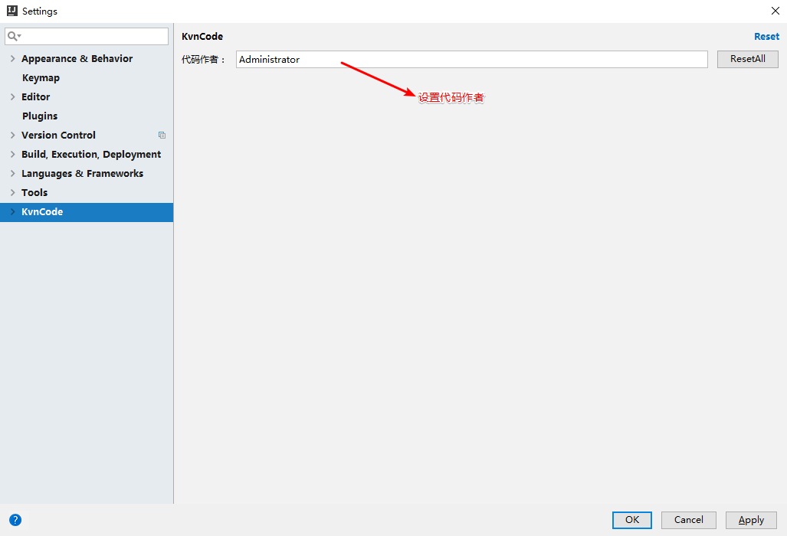
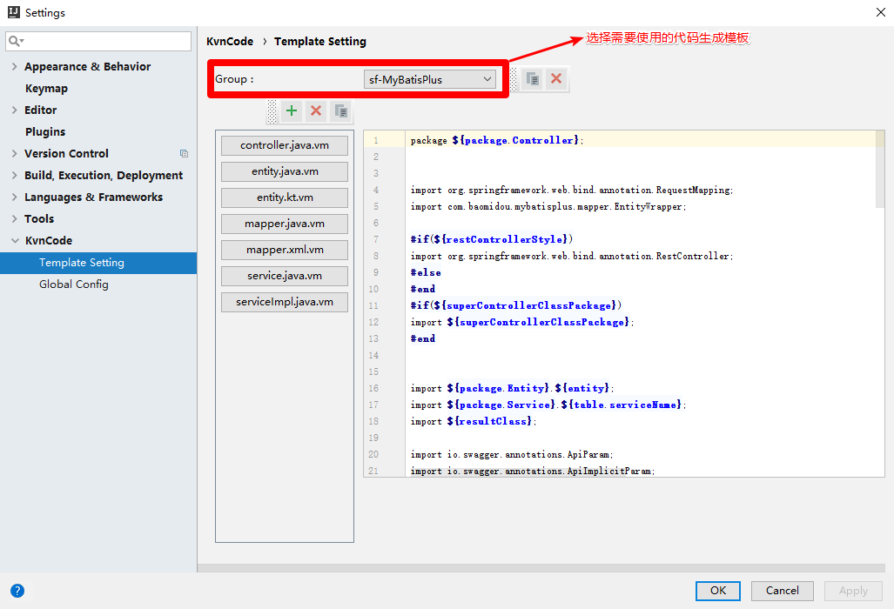
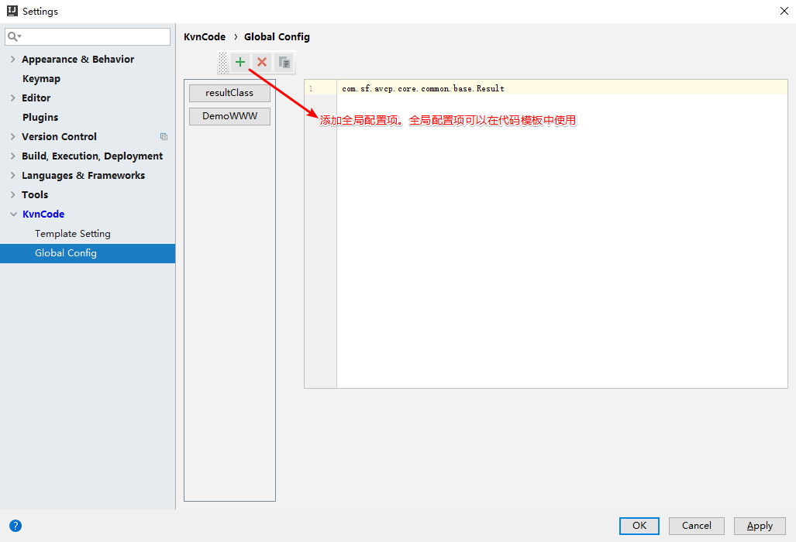
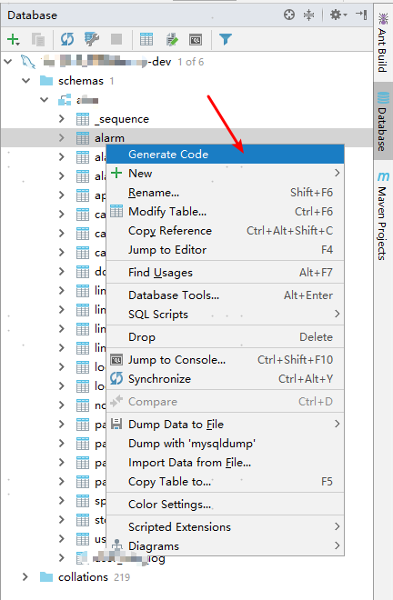
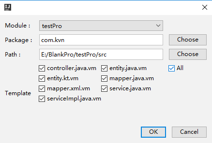

# kvn-code-plugin

#### 项目介绍
idea插件，自动生成spring+mybatis代码。模板可以自定义扩展

#### 实现
插件的gui实现是参考：[EasyCode](https://gitee.com/makejava/EasyCode)  
生成模板代码是使用mybatis-plus-generate-2.1.8.jar改造的。

#### 下载地址
[kvn-code-plugin.zip](kvn-code-plugin.zip)

#### 使用

